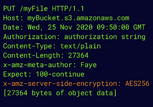
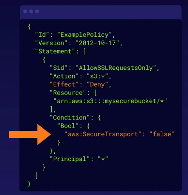

# aws s3 encryption
Data can be encrypted in several ways using S3.

**Encryption types:**
1. Encryption in transit - SSL/TLS, HTTPS for upload/download
1. Encryption at rest - server side encryption
    * Files are encrypted once uploaded to the server
    * SSE-S3 - s3 managed keys, using AES 256-bit encryption
        * Encrypted with unique key
        * AWS managed the keys for you
        * The master key is also encrypted
    * SSE-KMS - AWS Key Management Service managed keys
        * Separate permissions for use of additional key (envelope key, encrypts data's encryption key)
        * Audit trail to record usage of encryption key (who, what, when)
    * SSE-C - Customer provided keys
        * You manage your own keys, rotation, lifecycle, etc.
        * AWS manages storing the keys
1. Encryption at rest - client side encryption
    * You encrypt the files before uploading

## Enforcing server side encryption
You can ensure that server side encryption is done prior to uploading files.

1. Console - selecting the encryption setting on the bucket, usually the easiest
1. Bucket policy - ensuring the policy of the bucket states that it requires encryption

## Encrypt files on upload to S3
PUT requests are object uploads to S3. To ensure encryption happens at the time of upload,
include the following:

1. S3 put request contains metadata about the object and the object itself
1. If the file is encrypted at upload time, the `x-amz-server-side-encryption` parameter
is included in the request header
    1. Option 1 - `x-amz-server-side-encryption: AES256`
    1. Option 2 - `x-amz-server-side-encryption: aws:kms`
1. PUT request header - the parameter is included in the header of the PUT request, telling S3
to encrypt the object at time of upload, using the specified method

Example encrypted file upload to S3:

## Enforcing encryption in transit
Utilizing a bucket policy can ensure that we require encryption in transit (ex: HTTPS/SSL).

This explicitly denies any requests that do not use `aws:SecureTransport`.

S3 only serves content over HTTPS/SSL and will deny all unencrypted (HTTP) access.

Example bucket policy to ensure only encrypted connections can access:

## Exam tips for S3 encryption
* Encryption in transit to ensure HTTPS/SSL, deny non-encrypted connections
* Encryption at rest - server side - SSE-S3 (AES 256-bit), SSE-KMS, SSE-C
* Encryption at rest - client side - Encrypt the files locally before uploading to S3
* Enforcing encryption with a bucket policy - explicitly denying requests without a
`x-amz-server-side-encryption` parameter in the request.
    * Can also use a bucket policy to deny requests that don't use `aws:SecureTransport`

