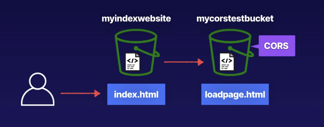

# cross origin resource sharing CORS configuration
Cross origin resource sharing allows things like S3 bucket objects to be accessed from
another bucket.

Example architecture for CORS setup:

## Enabling CORS
Open the `Cross-Origin resource sharing configuration` in S3.

Paste the URL for the bucket you'd like to access. Ensure that the headers settings
are also pasted in.

