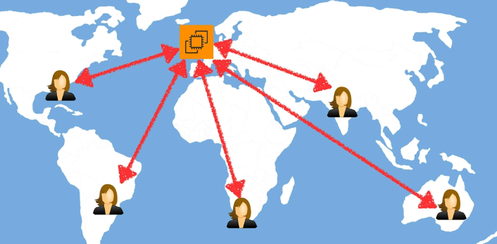
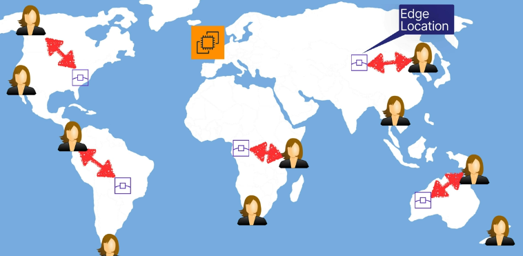
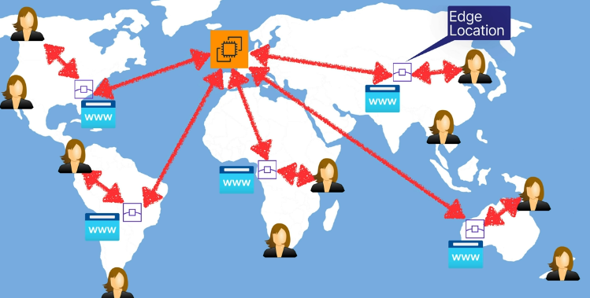

# aws cloudfront for content delivery
Distributed servers to deliver webpages and other web content. Speeds distribution
of static and dynamic content with low latency and high data transfer speed.

Great, inexpensive way for geographically distributed users to access your site.
Overall reduces the number of network hops for geographically distributed users to
reach your site.

Example website hosting without a CDN:

Example website hosting with a CDN (CloudFront):

Example request through a CDN:

Requests in this regard are only going to the local edge location. This ensures that
the CloudFront CDN caches any pages on each request, then refreshes them.

## Terminology
* CloudFront Edge location - location where content is cached. Separate from AWS Region/AZ
* CloudFront origin - origin of all files that the distribution serves.
    * This can be S3, EC2, load balancer, or Route 53
* CloudFront distribution - name given to the origin and configuration settings for the
content you want to distribute using CloudFront (CDN)

## Edge locations
* Can deliver the entire website for remote users
* Global network of 200+ edge locations
* Requests for content are routed to the nearest edge location, ensuring it is receiving
the best possible performance
* Optimizes performance for users across the world

## Integrations
* Optimized to work with other AWS services
* Integrated with S3, EC2, ELB, Route 53
* Can also work with your own local servers

## Time to live (TTL)
Objects are cached fora period of time, this is the object life cycle (Time to Live).
* Default TTL is 1 day, when the TTL is up the object is cleared from the cache automatically
* Clearing an object yourself is possible, but incurs a charge

## CloudFront & S3 transfer acceleration
* S3 transfer acceleration enables fast, easy, and secure file transfer over long
distances between your end users and an S3 bucket
* When data arrives at an edge location it is routed to S3 over an optimized network path

## CloudFront exam tips
* Edge location - location where content is cached. Separate from AWS Region/AZ
    * Not just READ only, can have WRITES too
* Origin - origin of files to distribute. Supports multiple services
* Distribution - name of origin and config settings for content
* S3 transfer acceleration allows for fast upload to S3
* Time to live (TTL) - cached life cycle of the object, set to 1 day

