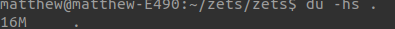
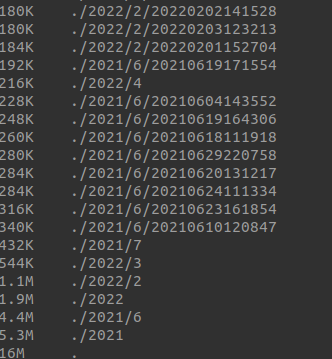

# finding directory sizes using the terminal
Finding directory sizes is important when needing to gather information about
filesystems.

Resources:
[`du` command](https://www.geeksforgeeks.org/du-command-linux-examples/)

Example with `-h` for human readability:
```
du -h /path/to/directory
du -hs . # current directory, summarized
```

Output:


**Note:** The `-s` flag summarizes.

Example with `-hs` to sort:
```
du -hs . | sort -h
```

This will yield information sorted largest -> smallest in a human readable format.

Output:


Another useful trick would be to add exclusions (like `.git/`):
```
# greps can be chained together
du -hs . | sort -h | grep -v <exclusion> | grep -v <exclusion> | ...
```

Output:


