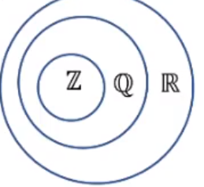

# basic set theory
Sets are used to group objects together. Often these objects have similar properties and
it is common to encounter situations where elements of one set are also elements of another set.

* Set - unordered collection of distinct objects
    * Example: `{1, 2, 3}` is a set with elements 1, 2, and 3
    * Let `S` denote a set
        * `x ∈ S` means that `x` is an element of `S`
        * Example: `1 ∈ {1, 2, 3}, 3 ∈ {1, 2, 3}`

    * `x ∉ S` means that `x` is not an element of `S`
        * Example: `4 ∉ {1, 2, 3}`

## Describing sets
* Listing all elements of a set, typically only for small sets
    * If the bounds of the set is infinite this won't work
* Using set builder notation - `{n | n > 2, n ∈ R}`
    * Where `R` is a set (all real numbers)
    * Here we say "all numbers `n` that are greater than 2 for all `n` in the set `R`"

## Subset and set equality
* Set A is a **subset** of set B if every element of A is also in B
    * We write this as `A ⊆ B`, if A is a subset of B
        * This says "A and B could be equal" because they could be the same set,
        and they are still subsets if equal
* Rewriting a subset statement as an implication:
    * `A ⊆ B ↔ ∀ x, if x ∈ A then x ∈ B`
        * Where this is an implication, stating that we can prove a set is a subset
        by proving the implication
    * `A ⊈ B ↔ ∃ x such that x ∈ A and x ∉ B`
        * Where this is an implication, stating that we can prove a set is NOT a subset
        by proving the implication

* Set A is a **proper subset** of set B if:
    * `A ⊂ B ↔ A ⊆ B`
    * There must be at least one element of B that is not in set A, wherein they are not equal sets

* Set A is **equal** to set B (`A = B↔ A ⊆ B↔ B ⊆ A`) where both sets are subsets of each other
    * Each set must have the same elements

## Element method - Proving that one set is a subset of another
Element method - We need to prove an implication to determine if a set is a subset.

Let sets A and B be given. To prove that `A ⊆ B`:
1. Suppose that `x` is a particular (but arbitrarily chosen) element of A,
1. Show that `x` is also an element of B

Example:
Show that `A ⊆ B`:
* A = `{m ∈ Z|m = 6r + 12}` for some `r ∈ Z`
* B = `{n ∈ Z|n = 3s}` for some `s ∈ Z`

Suppose `x` is a particular but arbitrarily chosen element of A.
Show that `x ∈ B`

* By definition of A, there is an integer `r` such that `x = 6r + 12`
* So, to be `x ∈ B`, `x = 3s`, where `s` is an integer
    * We must check that `s` is an integer
* From the above, we get: `6r + 12 = 3s`
    * `s = 2r + 4` - we know this is an integer because sum/product of integers is an integer
* Now we check that `x = 3s`
* Plugging the value of `s` from above, we get `3s = 3(2r + 4) = 6r + 12 = x`

We now know that A has an element that matches with B,
`A ⊆ B` is true

## Element method - Disproving that one set is a subset of another
We use an implication, the same as the proving of a subset.

Let sets A and B be given. To disprove that `A ⊆ B`:
1. Suppose that `x` is a particular element of A
1. Show that `x` is not a subset of B
**Giving a counterexample**

Example:
Disprove that `B ⊈ A`:
* A = `{m ∈ Z|m = 6r + 12}` for some `r ∈ Z`
* B = `{n ∈ Z|n = 3s}` for some `s ∈ Z`

* Assume `x ∈ B`
* Let `x = 3 * 1` as `1 ∈ Z` so, `3 ∈ B`
    * Now is `3 ∈ A`?
* `6r + 12 = 3`, where `r` must be an integer
    * `2r + 4 = 1`
    * `2r = -3`
    * `r = -3/2`

**But `r = -3/2` is not an integer (∉ Z)**

**Note:** To prove that two sets are equal we have to prove 2 things:
1. That one set is a subset of another
1. That the second set is a subset of the first

## Venn diagram - showing that one set is a subset of another
If we have subsets, we can visually represent them with diagrams.

Example with A being a subset of B (`A ⊆ B`):

Example with A not being a subset of B (`A ⊈ B`):

## Venn diagram - showing relations among sets of numbers

Example:
`Z, Q, R` denote the sets of integers, rational numbers, and real numbers

We can say:
* `Z ⊆ Q` because every integer is rational (any integer `n` can be written in the form `n/1`)
* `Q ⊈ Z` because there are rational numbers that are not integers (ex: `1/2`)
* `Q ⊂ R` because every rational number is a real number
* `Q` is a **proper** subset of `R` because there are real numbers that are not rational (ex: `sqrt(2)`)

The venn diagram of this would be:

