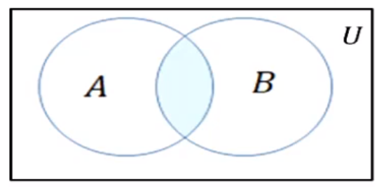
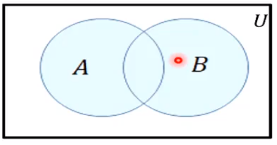
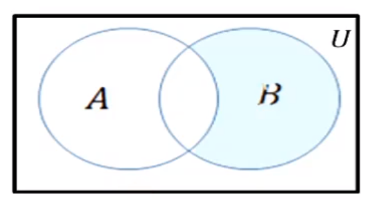
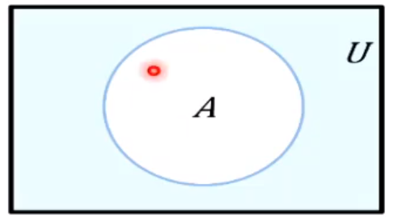
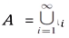

# operations in sets
Here we focus on the topic that sets can be combined in various ways, similar to
adding/multiplying numbers, etc.

Howevver, operations on sets tend to mimic logical operations like disjunction,
conjunction, and negation - rather than the arithmetical operations on numbers.

The most basic operations:
* Union
* Intersection
* Relative complement
* Difference

More complex operations:
* Power set formation ( a "powerful" operation) - allows us to form very big sets
* Partition of sets
* Cartesian products

## Operations - Intersection
* Intersection - the set of all elements that are **in common** between sets

Let `A, B` be subsets of a universal set `U`

The intersection is: `A ∩ B`


Mathematically this is represented as:
`A ∩ B = { x ∈  U | x ∈  A and x ∈  B}`

Example:
Let `U = {a, b, c, d, e, f, g}`
Let `A = {a, c, e, g}`
Let `B = {d, e, f, g}`

The intersection of these two sets:
`A ∩ B = {e, g}`

## Operations - Union
* Union - the union is the set of all elements that are in at least one of the sets,
essentially all matching (common) elements of the sets

The union is: `A ∪ B`


Mathematically this is represented as:
`A ∪ B = { x ∈  U | x ∈  A or x ∈  B}`

Example:
Let `U = {a, b, c, d, e, f, g}`
Let `A = {a, c, e, g}`
Let `B = {d, e, f, g}`

The union of these two sets:
`A ∪ B = {a, c, d, e, f, g}`

## Operations - Difference
* Difference - the set of all elements that are in the first set and not in the second
    * Typically this is denoted with a minus sign `-` or backslash `\`

The difference is: `B - A` or `B\A`


Mathematically this is represented as:
`B - A = { x ∈  U | x ∈  B and x ∉  A}`

Example:
Let `U = {a, b, c, d, e, f, g}`
Let `A = {a, c, e, g}`
Let `B = {d, e, f, g}`

The difference of these two sets:
`B - A = {d, f}`
`A - B = {a, c}`

## Operations - Complement
* Complement - the set of all elements in `U` that are not in a set, essentially
the `U - A` (assuming a set `A`)
    * All items in the universe that are not in the set.

The complement is: `A^c` (`A` to the power of `c`, can also use a **bar** over the letter)


Mathematically this is represented as:
`A^c = { x ∈  U | x ∉  A}`

Example:
Let `U = {a, b, c, d, e, f, g}`
Let `A = {a, c, e, g}`

The complement of these two sets:
`A^c = {b, d, f}`

## The empty set
* Empty or null set - a set with no elements
    * Denoted by `{}` or `Ø`
        * **Note:** This is NOT EQUAL to `Ø ≠ {Ø}`
    * An empty set is a subset of any set

Example:
`{1, 2} ∩  {3, 4} = Ø`
`{x ∈  R | 3 < x < 2} = Ø`

## Cardinality of a set
* Cardinality of a set - the number of elements of a set, denoted with `N(A)` or `|A|`
where `A` is some set

Example:
`|{2, 4, 6}| = 3` or `N({2, 4, 6}) = 3`
**Note:** The cardinality of empty sets is `0` (zero)

## Sets of sets
* The elements of a set can be a set itself, these would be nested sets

Example:
Let `A = { {a, b}, {1, 2}, {4}, 4}`
    * The last element `4` is not a set
    * The cardinality of this set is `|A| = 4`
        * Because the elements are sets themselves doesn't change that there are 4 elements

Let `B = {A} = {{ {a, b}, {1, 2}, {4}, 4 }}`
    * Set `B` has the above elements
    * The cardinality of set `B` is `|B| = 1`, it has 1 element

## Power set
* Power set - given a set `A` the power set of `A`, `P(A)` is the set of all subsets of `A`
    * Given a set `A` where `|A| = n`, then `|P(A)| = 2^n`

Example:
* `P({x, y}) = { Ø, {x}, {y}, {x, y} }`
    * These are all possible subsets of the set `{x, y}`
* `P(Ø) = {Ø}`
* `P({Ø}) = { Ø, {Ø} }`
    * This is a singleton set, where the set itself and empty set are included

## Partitions of sets
* Disjoint - `A` and `B` are disjoint if the sets `A` and `B` have no elements in common
* Mutually disjoint - The sets `A1, A2, A3, ...` are mutually disjoint (**pairwise disjoint or non-overlapping**)
if no two sets `Ai` and `Aj` where `(i ≠ j)` don't have any elements in common
* Partition - a finite or infinite collection of nonempty sets `A1, A2, A3, ...` is a partition
of a set `A` **if and only if**:
    * it is a union of all sets
        * 
    * All sets `A1, A2, A3, ...` are mutually disjoint

## Ordered Tuples
* Sets do not consider the order of elements
* Often times in CS we do care about order
    * Example: latitude and longitude coordinates
* Ordered n-tuple - `(a1, a2, ..., an)` has `a1` as its first element, `a2` as its second element, etc.
    * We have used parenthesis to imply that these are ordered
    * The order of elements is important
    * Note that `(a1, a2) ≠ (a2, a1)`, but `{a1, a2} = {a2, a1}`
        * Where sets are unordered and match, tuples are ordered and do not match

## Cartesian products
* Cartesian product - Defined as the set of ordered tuples `(a1, a2, ..., an)` where `a1 ∈  A1, a2 ∈  A2, ..., an ∈  An`
    * The cartesian product of sets `A1, A2, ..., An` is denoted by `A1 X A2 X ... X An`

Example:
Let `A = {x, y}, B = {1, 2, 3}, and C = {{a}, {b}}`
`A X B X C = {(u, v, w) | u ∈  A, v ∈  B, and w ∈  C}`
```
= {(x, 1, {a}), (x, 2, {a}), (x, 3, {a}),
   (y, 1, {a}), (y, 2, {a}), (y, 3, {a}),
   (x, 1, {b}), (x, 2, {b}), (x, 3, {b}),
   (y, 1, {b}), (y, 2, {b}), (y, 3, {b})}
```

