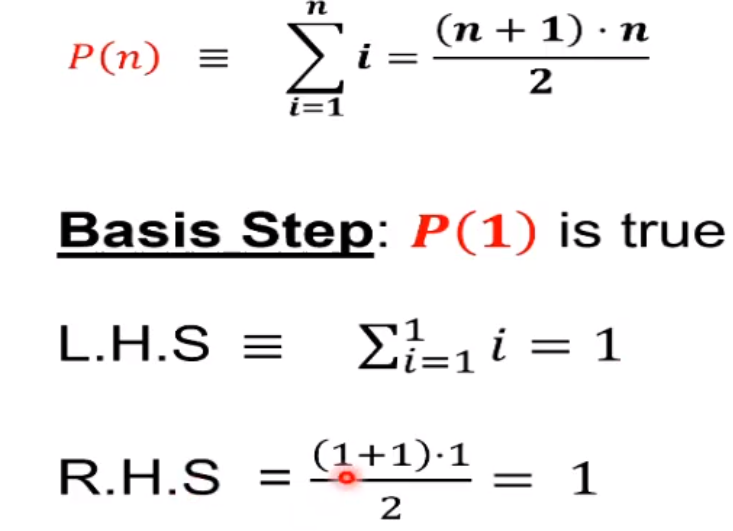

---

path: '/2022/4/weak-mathematical-induction-20220426200118'
title: 'weak mathematical induction'
date: '20220426200118'
category: 'discrete math'
tags: ['math', 'mathematical induction']
---

# weak mathematical induction
Weak mathematical induction is a proof technique designed to prove statements about all
natural numbers.

This is different than inductive reasoning, which uses repeated observations to support
a hypothesis.

Mathematical induction instead gives definitive proof, using smaller cases to build
upon each other and prove larger cases.

**Note:** This requires lots of algebra.

**Useful symbols:** ≥ ≤ = ¬ ∼ ∧ ∨ ⊕ ≡ → ↔ ∃ ∀

## Mathematical induction
* More recently developed proof technique
* It does not **generate answers** it can only prove them

## Weak induction
* Principle of weak mathematical induction:
    * Let `P(n)` be a property that is defined for integers `n` and let `a` be
    some integer. If the following statements are true:
        * `P(a)` is true
        * `∀ k ≥ a, P(x) → P(k + 1)`
        * Then the following conclusion is also true:
            "For every integer `n ≥ a, P(n)`"

This is a two step process (basis and inductive).

## Steps for a weak induction
1. Introduction
    1. State the property precisely:
        * "For every integer `n ≥ a` the property `P(n)` is true"
1. Proof (by mathematical induction)
    1. Show the basis step is true:
        * `P(a)` is true because ...
    1. State the inductive hypotehsis clearly:
        * Assume `P(k)` is true, where `k` is any particular but arbitrary integer with `k ≥ a`
    1. Show that the inductive step is true:
        * Assuming the inductive hypothesis `P(k)`, prove that `P(k + 1)` holds;
            * proving: `∀ k ≥ a, P(k) → P(k + 1)`
1. Conclusion:
    1. State the conclusion precisely:
        1. Since we have proved the basis step and inductive step, we conclude that
        the proposition is true.

Example:
Prove that algorithm `A` correctly sorts anyf inite list of numbers.

* `P(n) ≡ A` is correct for any list of length `n`
* Prove that `∀ n P(n)` for domain of non-negative integers
    * We want to prove that the problem is provable

### Example of weak induction
Prove that for any positive integer `n`

`1 + 2 + ... + n = ((n+1)*n)/2`

* `P(n) ≡ sum(i) i=1, n ≡ ((n+1)*n)/2`
* "For every integer `n ≥ 1` the property `P(n)` is true"

**Weak mathematical induction proof:**
* Basis step - prove `P(1)` is true
* Inductive step - prove the implication `∀ k ≥ 1, P(k) → P(k + 1)`

* Basis step: `P(1)` is true
    * Left hand side (sum side): `= 1`
    * Right hand side: `((1 + 1) * 1)/2 = 1`
    * We've proven `P(1)` holds true

Screenshot to avoid confusion with the lack of formula support:

* Inductive step - prove the implication `∀ k ≥ 1, P(k) → P(k + 1)`
    * We can try the direct proof approach, for most cases it will work
    * If we know `P(k)` is true, then we get `((k + 1) * k)/2`
        * Basically the same equation, with `k` in it
    * To prove `P(k + 1)` is true:
        * `((k + 2)*(k + 1))/2`
        * Note that we only have a difference of our previous statement  in this `+ 1` term
            * Often when working with the sum, we now want to rewrite this in terms of the hypothesis
            * `((k + 1) * k)/2 + ((k + 1) * 2)/2`
            * Now factor common expressions
            * `(k + 1)/2 * (k + 2)`
            * `= ((k + 2) * (k + 1))/2`
    * We can prove now that `P(k + 1)` holds true

### Example of weak induction
Prove using mathematical induction that for all `n ≥ 2, n^3 - n` is divisible by 6

`P(n) == 6 | n^3 - n or n^3 - n = 6m, m` is some integer
* For every integer `n ≥ 2`, the property `P(n)` is true

* Basis step: `P(2)` is true
* Inductive step: prove the implication `∀ k ≥ 1, P(k) → P(k + 1)`

* Basis step: `P(2)` is true
`2^3 - 2 = 8 - 2 = 6` which is clearly divisible by 6
This proves that the basis is true

* Inductive hypothesis: `P(k)` is true, `k ≥ 2`
`P(k) == 6 | k^3 - k or k^3 - k = 6q, q` is some ikteger
    * We're rewriting using our proven basis step

* Inductive step: we now prove `P(k + 1)` is true
`P(k + 1) == 6 | (k + 1)^3 - (k + 1) or (k + 1)^3 - (k + 1) = 6m', 6m'` is some integer

`P(k + 1) == (k + 1)^3 - (k + 1)`
`== k^3 + 3k^2 + 3k + 1 - k - 1`
`== (k^3 - k) + (3k^2 + 3k)`
`== (k^3 - k) + 3k(k + 1)`

* We can now substitute our `k^3 - k` for our equivalent value
`== 6q + 3k(k + 1)` (by inductive hypothesis step)
`== 6q + 3 * 2r` where `k(k + 1) = 2r, r` is some integer by the product of 2 consecutive integers always being even
`== 6q + 6r`
`== 6(q + r)`
`== 6m'`, using the closure property as some integer `m'`, where `q+r` is an integer because the sum
of integers is an integer

This holds to be true, it is equivalent.

### Example of weak induction
Prove using mathematical induction that for all `n ≥ 0, 1 + 3n ≤ 4^n`

`P(n) == 1 + 3n ≤ 4^n`
For every integer `n ≥ 0`, the property `P(n)` is true

* Basis step: prove `P(0)` is true
* Inductive step: prove the implication `∀ k ≥ 0, P(k) → P(k + 1)`

* Basis step: `P(0)` is true
`P(0) == 1 + 3(0) ≤ 4^0`
`== 1 + 0 ≤ 1`
`== 1 ≤ 1`

* Inductive hypothesis: `P(k)` is true, `k ≥ 0`

`P(k) == 1 + 3k ≤ 4^k` is true

* Inductive step: `P(k + 1)` is true

`P(k + 1) == 1 + 3(k + 1) ≤ 4^(k + 1)`

Right hand side: `4^(k+1) = 4 * 4^k = (3 + 1) * 4^k = 3 * 4^k + 4^k`
Left hand side: `1 + 3(k + 1) = (1 + 3k) + 3`

`(1 + 3k) + 3 ≤ 4^k + 3 ≤ 4^k + 3*4^k`

We know that this will always be true: `3 ≤ 3*4^k, k ≥ 0`

We can conclude these are true.

