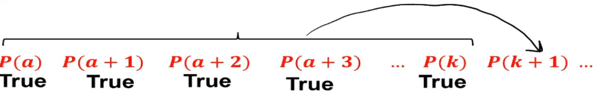

# strong mathematical induction
The strong form of mathematical induction allows us to assume the truth of all preceding
statements, not just the immediate predecessor (as in weak induction).

This is similar to the ladder analogy of proving the previous rung of the ladder
to build upon the statements as you prove things.

## Problems with weak mathematical induction
When using weak induction we can have problems assuming `P(k+1)` when assuming that
`P(k)` is true.

For instance, when using an infinite list of items, where we need to prove some `i`th
item in the list. Having to do this for some many steps in order to reach the
`P(k+1)` step would be **time consuming** and difficult.

Example: Proving the 1000th step of the statement.

Example: `P(1 to 3)` where `P(k)` is proven true by the step 2 iterations before
* Here we have to assume for `P(k+1)` that we know the step **2 times before** is true
* Strong induction allows this

Illustration of strong inductive hypothesis:

## Proving via strong induction
Let `P(n)` be a property that is defined for integers `n` and let `a, b` be fixed
integers with `a <= b` suppose the following are also true:
1. Basis step: `P(a), P(a+1), ..., P(b)` are all true
1. Inductive step: `∀ k >= b`, if `P(i)` is true for **each** integer `i` from `a`
through `k`, then `P(k+1)` is true.
    * `∀ k >= a, P(a) ^ P(a+1) ^ ... ^ P(k) -> P(k+1)`
    * The following conclusion is also true as well - "for every integer `n >= a, P(n)`"

Example:
Consider an infinite list of people.
    * The first 3 people are given a message
    * When the `j`th person in the list gets a message he/she gives the message
    to person `j+3` (if `j+3 <= n`)

Prove that for any `n`, the `n`th person will get the message.
`P(n) ==` person `n` receives the message.

* Basis step:
`P(1), P(2), P(3)` are true.

* Inductive hypothesis: Prove `P(1) ^ ... ^ P(k) -> P(k+1)`
    * We're trying to prove that everything `1 through k` is true to prove `P(k+1)`
    * This implies that the person `k - 2` received the message

* Inductive step:
    * Thus, person `k + 1` recieves the message from person `k - 2`.
    * So, `P(k + 1)` is true
        * This is because the previous steps were proven to be true by showing
        that the previous iterations were already matching `P(k+1)`

### Additional examples
Example:
Suppose `b_1, b_2, b_3, ...` is a sequence defined as follows:
* `b_1 = 4, b_2 = 12`
* `b_k = b_k-2 + b_k-1` for all integers `k >= 3`
* Prove that `b_n` is divisible by 4 for all integers `n >= 1`

`P(n) == 4 | b_n or b_n = 4 * m`, where `m` is some integer

Strong mathematical induction proof:
* Basis step: Show that `P(1), P(2)` are true
    * We need 2 steps to be proven true to prove the several other steps
    * `P(1) == b_1 = 4 = 4 * 1`
    * `P(2) == b_2 = 12 = 4 * 3`
    * These are both proven to be true

* Inductive hypothesis: `P(i)` is true for all `i` with `1 <= i <= k`
    * Here we can assume that `P(k)` and `P(k - 1)` are both divisible by 4 because
    we've proven it already
    * Let `k >= 2` be any integer, and suppose `4|b_i` for all integers `1 <= i <= k`
        * `b_k-1 = 4 * r` [r is some integer]
        * `b_k = 4 * s` [s is some integer]

* Inductive step: Show that `P(k+1)` is true
    * Show that `P(k+1) == 4 | b_k+1` or `b_k+1 = 4 * m'`, for some integer `m'`
    * `b_k+1 = b_k-1 + b_k`
        * The two terms `b_k-1 and b_k` are both divisible, defined preivously
    * `b_k+1 = 4r + 4s` where we substitute from above
    * `b_k+1 = 4 * (r + s)` by algebra
    * `b_k+1 = 4 * m'` where `m'` is some integer because of the sum of integers being integers, where `m' = r + s`

## Skeleton of a strong mathematical induction
Prove that every X amount of something.

The number of steps to use in the basis step to assume true is equal to the
**series of steps** that the item goes up and how far you need to prove it.

Meaning, how many times do we have to backtrack in the inductive step?

## Types of mathematical induction
* Weak induction - assumes `P(k)` is true, and uses that (and only that) to show
that `P(k+1)` is true
* Strong induction - assumes `P(a), P(a+1), ..., P(k)` are all true, and uses it to show
that `P(k+1)` is true

