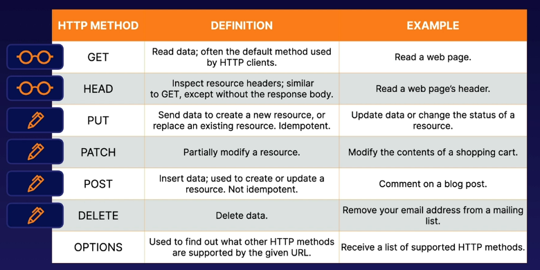

# aws cloudfront allowedmethods
Allowed HTTP methods in AWS CloudFront distributions are defined at creation time
for each distribution. This determines the control that you have over the specific
request types allowed for the distribution.

**Allowed HTTP methods:**
* Read-only: GET, HEAD
* Read-only: GET, HEAD, OPTIONS
* Read-write: GET, HEAD, OPTIONS, PUT, POST, PATCH, DELETE

## Use cases for each HTTP method

Supported HTTP methods are used to modify, read, or inspect websites.

