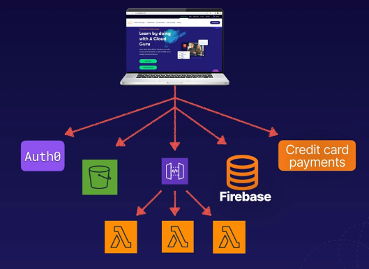

# aws serverless intro
Serverless allows developers to run application code in the cloud without managing
any server infrastructure. AWS handles the infrastructure management tasks to avoid
having that bog down development time, instead we just focus on writing code.

## Automated infrastructure management tasks
* Capacity provisioning
* Patching operating systems
* Auto scaling infrastructure
* High availability

## Competitive advantage
* Increases speed to market - eliminates overhead of managing servers and releases
code quickly
* Very scalable - we can have a million+ users on a site that would scale automatically
* Lower costs - never pay for over-provisioning
    * Serverless applications are event-driven and only charged when code is executed
* Focus on the application - by not focusing on the infrastructure you can focus
on business logic
    * AWS offers a range of serverless technologies that integrate seamlessly

## Example serverless technologies
**Note:** Typically serverless technologies are stateless; however, they can call other
services that would hold state.

* Lambda - enables you to run code as functions without provisioning servers
* Simple queue service (sqs) - Message queuing service to decouple and scale apps
* Simple notification service (sns) - messaging service for sending texts, mobile notifications, emails
* API Gateway - allows you to create, publish, and secure APIs at any scale
* DynamoDB - a fully managed NoSQL database
* S3 - object storage and web hosting

## Example serverless architecture
An example serverless architecture for a website using Auth0, S3, API Gateway,
Firebase (NoSQL), Lambda, credit payments.

## Serverless exam tips
* Serverless - Enables you to build scalable applications quickly without any server management
* Low cost - serverless apps are event-driven and only charge when the code is executed
* AWS handles heavy lifting - including provisioning, scaling, patching, etc.

