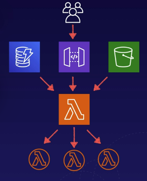

# aws lambda intro
AWS Lambda is a serverless compute service that runs application code without provisioning
servers to manage.

## Lambda features
* Takes care of everything to run code, including runtime environments.
* Supported languages - Java, Go, PowerShell, Node.js, C#, Python, Ruby
    * Upload code to Lambda and you're good to go
* Enterprise features - auto-scaling and high availability

## Pricing
Pricing is based on several components:
* Number of requests
* Request duration
* Amount of memory utilized by the lambda function to execute

1. Requests
    1. The first 1 million requests per month are free
    1. $0.20 per month per 1 million requests after the first million
1. Duration
    1. Charged in the 1 millisecond increments
    1. The price depends on the amount of memory that is allocated to the lambda function
1. Price per GB-second
    1. $0.00001667 per GB-second
    1. A function that uses 512 MB and runs for 100ms:
        1. 0.5GB X 0.1s = 0.05 GB-seconds = $0.0000000083
        1. The first 400,000 GB-seconds per month are free

## Event driven architecture
Serverless applications use an event-driven architecture.

1. Event-driven - lambda functions can be automatically triggered by other AWS
services or called directly from any web or mobile app.
1. Triggered by events - These events can be changes made to data in an S3 bucket,
or a DynamoDB table
1. Triggered by user requests - You can use API Gateway to configure an HTTP
endpoint allowing you to trigger your function at any time using an HTTP request

Example serverless architecture showing triggers for Lambda:

* Fun fact - Amazon Alexa and Echo both use Lambda, triggered by voice

## AWS services that can invoke lambda functions
Below are only **some** services that can trigger lambdas.
* DynamoDB
* Kinesis
* SQS
* Application Load Balancer
* API Gateway
* Alexa
* CloudFront
* S3
* SNS
* SES
* CloudFormation
* CloudWatch
* CodeCommit
* CodePipeline

## Exam tips
1. Extremely cost effective - pay only when code executes
1. Continuous scaling - lambda scales automatically
1. Event-driven - lambda functions are triggered by an event or action
1. Independent - functions are independent, each event triggers a single function
1. Serverless technology - Lambda, API Gateway, DynamoDB, S3, SNS, SQS
1. Lambda triggers - be aware of services that can trigger a lambda function

