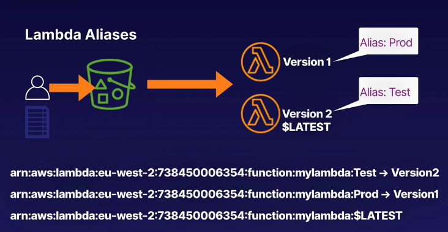

# aws lambda versions
Lambda versioning allows us to control what lambdas are run, to allow backward
compatibility, testing, staging, etc.

## Versioning
* When you create a lambda function, there is only 1 version: $LATEST
* When you upload a new version of the code to Lambda, the new version becomes $LATEST
* You can create multiple versions of your function and use aliases to reference them
as part of the ARN of the function
    * Example: Development environment may maintain multiple versions of the same function
    to develop and test code
* An alias is like a pointer to a specific version of the function

Example Lambda versioning:

* Versions of the lambda can be sent between different versions of functions based
on weighted percentages (%)

