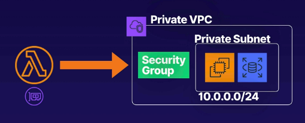

# aws lambda vpc access
Enabling AWS Lambda functions to access resources inside private AWS VPCs
has use cases for development when working with private resources.

* Some use cases require Lambda to access resources which are inside a private VPC
    * Example: Read or write to an RDS database, or shut down an EC2 instance
    in response to a security alert

## Enabling Lambda to access VPC resources
* To enable this, you need to allow the function to connect to the private subnet
* Lambda needs the following VPC Configuration information:
    * Private subnet ID
    * Security group ID (with required access)
    * Lambda uses this information to set up ENIs (elastic network interfaces)
    using an IP address from the private subnet

* You can add VPC information to the function using the `vpc-config` parameter
on the AWS CLI

Example AWS CLI call:
```
aws lambda update-function-configuration \
    --function-name <name> \
    --vpc-config SubnetIds=<id>,SecurityGroupIds=<sg-id>
```

Example diagram showing a Lambda utilizing a VPC connection:



**Note:** The Lambda function needs permission to create elastic network interfaces (ENI)
in order to utilize the VPC. This is part of the IAM policy attached to the lambda execution
role.

Example actions for Lambda to create ENIs in a VPC:
```json
"Action": [
    "ec2:CreateNetworkInterface",
    "ec2:DeleteNetworkInterface",
    "ec2:DescribeNetworkInterfaces"
]
```

## Exam tips
* It is possible to enable Lambda to access resources which are inside a private VPC
* Provide **VPC config** to the function (private subnet ID and security group ID)
* Lambda uses the VPC information to set up ENIs using an IP from the private
subnet CIDR range (available IPs)
* The security group allows the function to access resouces in the VPC

