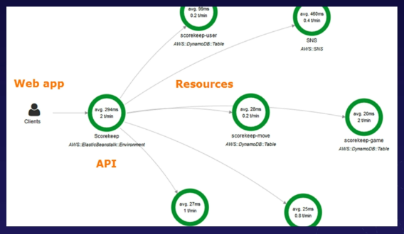

# aws x-ray analysis and debugging
X-Ray is a tool which helps developers analyze and debug distributed
applications.

This allows developers to troubleshoot the root cause of performance issues and
errors by providing a visualization of the application's underlying components.

Example X-Ray service map visualizing requests:

## X-Ray integrations
* AWS services:
    * EC2
    * ECS
    * Lambda
    * Elastic Beanstalk
    * SNS
    * SQS
    * DynamoDB
    * ELB
    * API Gateway
* Integrate with apps:
    * Java
    * Node.js
    * .NET
    * Go
    * Ruby
    * Python
* API Calls
    * X-Ray SDK captures metadata for API calls made to AWS services using
    the AWS SDK

## X-Ray architecture
1. Install the X-Ray Agent on the EC2 instance
1. Instrument the application using X-Ray SDK (configure)
1. X-Ray SDK gathers information from:
    1. Request and response headers
    1. Code in your application
    1. Metadata about AWS resources on which it runs

## Exam tips
* X-Ray helps developers analyze and debug distributed applications
* Provides a visual service map of your application
* X-Ray Agent and the SDK need to be installed and configured on your EC2 instance
    * The SDK instruments the application to send traces to X-Ray

