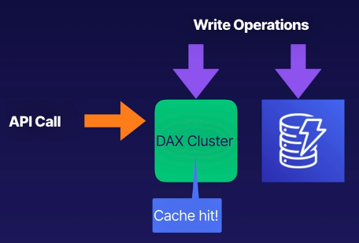
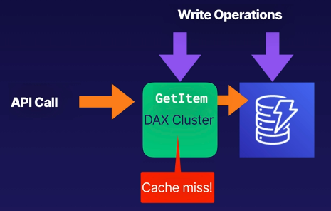

# aws dynamodb accelerator DAX
DAX - the DynamoDB Accelerator is a fully managed, clustered in-memory cache
for DynamoDB.

This only gives performance increases for **read performance**. Gives microsecond
performance for millions of requests per second, nearly 10x the normal performance.

Great for read-heavy and bursty workloads like auction applications, gaming, and retail
sites during huge promotions (like Black Friday).

## How does it work?
DAX is a write-through caching service. Data is written to the cache and the backend store
at the same time.

This allows you to point API calls to the DAX cluster rather than the DynamoDB table.

If the item you're querying is in the cache (**a cache hit**) then DAX returns the result.
When the DAX cache doesn't have a match for the data record it performs an eventually
consistent read, then passes the result to the application (and writes the result to
the cache).

Example cache hit:

Example cache miss:

## Benefits of DynamoDB Accelerator
* Reduces the read load on DynamoDB tables.
* May be able to reduce provisioned read capacity on your table (save DynamoDB costs)

## Not suitable for
* Caters only to eventually consistent reads, not suitable for **strongly consistent** reads
* Not suitable for write-intensive applications because it only helps with read operations
* Applications that don't perform many read operations won't see a huge benefits
* Applications that don't require microsecond response times

