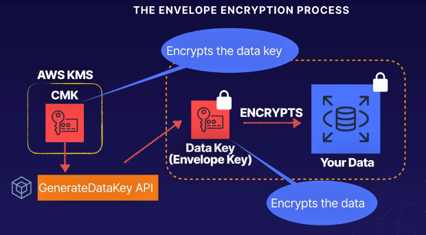
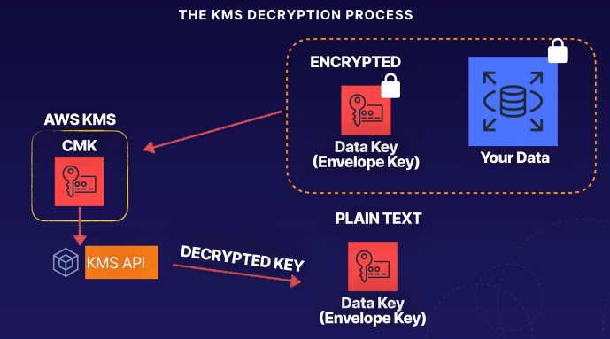

# aws kms envelope encryption
A process of encrypting data for data >4KB in size.

**Envelope encryption process:**
1. AWS KMS CMK exists
1. GenerateDataKey API
1. DataKey (Envelope key) is then placed on the host
1. The data key is used to encrypt the data, then is stored locally for decryption.
1. The KMS service then uses the key to decrypt the data in memory and return the
data for reading

Example encryption scenario with envelope keys:

Example decryption scenario with envelope keys:

## Why envelope encryption?
Why not encrypt the data using the CMK directly?

* Network - when you encrypt data directly with KMS it must be transferred over
the network
* Performance - WIth envelope encryption, only the data key goes over the network, not
your data itself
* Benefits - the data key is stored locally which is used locally in your application
or AWS service, avoiding the need to transfer large amounts of data to KMS (think in GB or TB in size)

## Envelope encryption
* Encrypting the key that encrypts our data
* The CMK is used to encrypt the data key (or envelope key)
* The data key encrypts our data
* Used for encrypting anything >4KB
* Using the envelope encryption avoids sending all your data into KMS over the network
* Remember the GenerateDataKey API call

