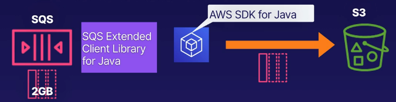

# aws sqs delay queues
SQS delay queues postpone the delivery of new messages.

## Features
* Postpone delivery of new messages for a certain number of seconds.
* Messages sent to the **delay queue** remain invisible to consumers for the
duration of the delay period.
    * Standard queues - Changing the setting doesn't affect the delay of messages
    already in the queue.
    * FIFO queues - Changing the setting will affect all messages currently in the queue.
* Default delay is 0 seconds, maximum is 900 seconds

## When to use a delay queue
* Large distributed applications may need to introduce a delay in processing
* You may need to apply a delay to an entire queue of messages
    * Examples could be a few second delay to allow for sales and stock control database
    updates before telling a customer their online transaction is confirmed

## Managing large SQS messages
* Best practice for managing large SQS messages (using S3):
    * For large SQS messages between 256KB and 2GB (max)
    * Use S3 to store the messages
    * Use the Amazon SQSX Extended Client Library for Java
    * Use the AWS SDK to use an API for S3 and object operations

The SQS message setup with S3:

### SQS Extended Client Library for Java
* Specify that messages are always stored in S3 ***OR*** only messages >256KB
* Send a message which references a message object stored in S3
* Get a message object from S3
* Delete a message object from S3

### Things you need
* AWS SDK for Java
* SQS Extended Client Library for Java
* An S3 bucket

### Things you can't use
* AWS CLI
* AWS Management Console / SQS Console
* SQS API
* Any other AWS SDK

## Exam tips
* SQS delay queue
    * Postpone delivery of new messages
    * Messages are invisible for the delay period (0-900s)
    * Large distributed apps may need to introduce delays
* Managing large messages in S3
    * Store messages between 256KB - 2GB in S3
    * Uses the AWS SDK for Java
    * **Can** use Amazon SQS Extended Client Library for Java
    * **Can't** use the AWS CLI/Management Console/SQS Console

