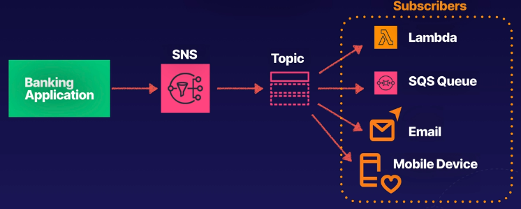

# aws sns intro
Simple Notification Service (SNS) is a web service that makes it easy to set up,
operate, and send notifications from the cloud.

Messages sent from an application can be immediately delivered to subscribers or
other applications.

## Notification types
* Push notificaitons - Sends notifications to devices like Apple, Google,
Fire OS, Windows, Android
* SMS and email - SMS text message or email to AWS SQS or any HTTP endpoint
* Lambda - trigger lambda functions to process the information in the message,
publish to another SNS topic, or send the message to another AWS service

## How does it work?
* A pub-sub model (publish and subscribe)
* Applications can **PUBLISH** or **PUSH** messages to a **TOPIC**
* Subscribers can **RECEIVE** messages from a **TOPIC**
* Notifications are delivered using a push mechanism that eliminates the need
to periodically check or poll for new information and updates

Example architecture of a banking application with notification subscribers:

## What is a topic?
An access point, allowing recipients to subscribe to, and receive identical copies
of the same notification.

SNS delivers appropriately-formatted copies of the message to each suscriber depending
ont he device/OS/protocol.

## What about durability?
* Durable storage - prevents messages from being lost
* All messages published to Amazon SNS are stored redundantly across multiple
availability zones

## SNS benefits
* Instantaneous - instantaneous, push-based delivery (no polling)
* Simple - simple APIs and easy to integrate with applications
* Flexible - message delivery over multiple transport protocols
* Inexpensive - pay-as-you-go model with no up-front costs
* Easy to configure - web-based AWS console offers simplicity of point-and-click
* Managed service - the durability and reliability of a managed service

## Selecting the right solution
Given a specific scenario, you may have to choose between SNS and SQS.

* SNS:
    * Messaging service
    * SNS is push-based
    * Think about push notifications
* SQS:
    * Messaging service - held in a queue not delivered
    * SQS is pull-based - needs to be actively checked
    * Think polling the queue for messages

## Exam tips
* Notifications - scalable and highly available notification service that sends push
notifications from the cloud
* Message formats - SMS, email, SQS queues, or any HTTP endpoint
* Pub-Sub - users subscribe to topics, push mechanism rather than a pull (or poll)
mechanism

