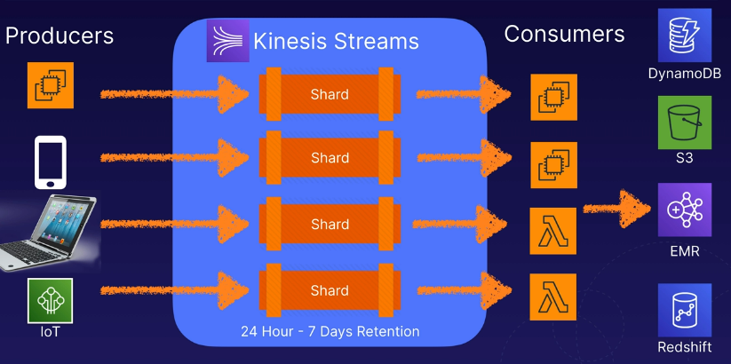
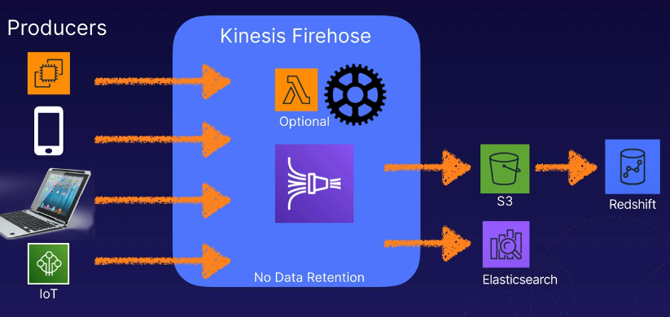
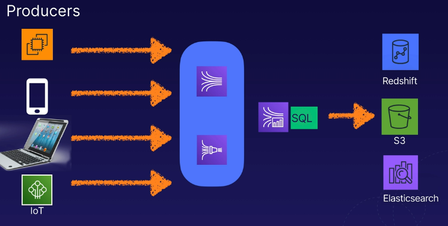

# aws kinesis intro
Amazon Kinesis is a family of services to collect, process, and analyze streaming
data in real-time.

Allows you to build custom applications and take action on the analysis of the
data that you're streaming.

## Streaming data
Data generated continuously by thousands of data sources, typically send in the data
records simultaneously and in small sizes (kilobytes).

Examples:
* Financial transactions
* Stock prices
* Game data
* Location tracking data (Uber)
* Log files

Designed specifically for high-throughput analysis.

## Four core services
There are a family of services that deal with streaming data.

### Kinesis streams
Stream data and video to allow you to build custom applications that process data
in real-time.

* Data streams & video streams

### Kinesis data firehose
Allows users to capture, transofrm, load data streams into AWS data stores
to enable near-real-time analytics with BI tools

We can transform the raw data, load it into something, and analyze all directly
from within Kinesis Data Firehose.

### Kinesis data analytics
Analyze, query, and transform streamed data in real-time using standard SQL.

Results can be stored in an AWS data store like Redshift, S3, or Elastic Search

## Kinesis streams
* Retains data for a 24 hour - 7 day period (default is 24 hours)
* Data is stored in one or more shards, then made available to data consumers
* The consumers (EC2 or maybe Lambdas) will take the data from a shard, process it,
then can decide where the data will go/what their outcome would be

Example of a Kinesis Stream that facilitates data ingest:

## Kinesis shards
Shards only apply to Kinesis Streams (not in analytics or firehose).

A shard is a sequence of one or more data records and provides a fixed unit of capacity.
* 5 reads per second
* Max total read rate is 2 MB per second
* 1,000 writes per second
* The max total write rate is 1 MB per second

The data capacity of the stream is determined by the number of shsards. If data rates
increase, you can increase the number of shards to help throughput.

## Kinesis data firehose
Consumers aren't needed to consume the data in firehose. Additionally, there are not
any shard requirements because capacity is autoscaled on the users behalf.

Lambdas are avaialble as an option to process data in real-time from the producers
before sending data to be stored somewhere.

* **Note:** Firehose has ***no*** data retention. The data is either immediately
consumed by a Lambda or it is put into some permanent storage solution.

The setup is automated, using Lambda for any processing, and just saving straight
to a permanent storage solution.

Example Kinesis Firehose architecture:

## Kinesis data analytics
Allows us to query in real-time using SQL. We can query Kinesis Streams and Kinesis Data Firehose
then store the results in some permanent storage location (Redshift, S3, etc.).

Works with both of the Kinesis Stream types and Firehose, enabling real-time analytics.

Example Kinesis Data Analytics architecture:

## Kinesis service differences

* Streams:
    * Capture and store streaming video and data for real-time processing and analysis
    * Consumer applications process and analyze data in real-time
* Firehose:
    * Capture, transofrm, and load data continuously into AWS data stores
    (or things like Datadog/Splunk).
    * Existing BI applications and tools can be used for near real-time analysis
    of the stored data.
* Analytics:
    * Real-time analytics using standard SQL on data received by Kinesis Data
    Streams and Kinesis Data Firehose.
    * Stores the processed data in AWS data stores (S3, Redshift, etc.)

