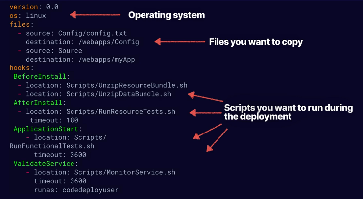

# aws codedeploy features
CodeDeploy offers CICD in various ways, these were covered in a previous note
that had an overview of the different code hosting solutions that AWS offers.

## More nitty gritty features
* In-place deployment:
    * capacity is reduced during the deployment
    * Lambda is not supported
    * Rolling back involves a re-deploy
    * Great when deploying the first time
* Blue/Green deployment:
    * No capacity reduction (safest option)
    * Green instances can be created ahead of time
    * Easy to switch between old and new
    * You pay for 2 environments until you terminate the old servers

## CodeDeploy AppSpec file
* `AppSpec` file - Configuration file for the parameters to be used during the CodeDeploy
deployment
* For EC2 and on-premises systems the file is YAML only
* For Lambda YAML and JSON are supported

### EC2 AppSpec file structure
* version - reserved for future use (0.0 is only value now)
* OS - operating system version you're using (linux, windows, etc.)
* files - config files, packages, locations of where files are and should be copied to
* hooks - lifecycle event hooks, aka scripts that need to run during the deployment
lifecycle. Hooks have a specific run order

Example scripts during a deployment:
* Unzip application files
* Run tests on a newly deployed application
* Deal with load balancing - de-register and re-register instances with a load balancer

Example EC2 appspec.yml:

Typical folder structure for CodeDeploy is:
* appspec.yml
* /Scripts
* /Config
* /Source

**Note:** The appspec.yml file needs to be in the root directory

### AppSpec lifecycle event hooks
Lifecycle event hooks happen in 3 phases during a deployment.
* Phase 1:
    * De-register instances from a load balancer
* Phase 2:
    * Nuts and bolts of the application deployment
* Phase 3:
    * Re-register instances with the load balancer

#### Phase 1
The following are in order of execution for lifecycle event hooks before deployment:
* BeforeBlockTraffic:
    * Tasks that youw ant to run on instances before they are deregistered from
    a load balancer
* BlockTraffic:
    * Block - de-register instances from a load balancer
* AfterBlockTraffic:
    * Tasks you want to run on instances after they are de-registered from a load
    balancer

#### Phase 2
Run order for an in-place deployment:
* ApplicationStop - gracefully stop the application
* DownloadBundle - CodeDeploy agent copies application files to a temp location
* BeforeInstall - pre-installation scripts, like backing up a current version, decrypting files
* Install - copy application revision files to final location
* AfterInstall - post-install scripts like configuration, file permissions, etc.
* ApplicationStart - start any services that were stopped during ApplicationStop
    * Could be a script or set of commands to run
* ValidateService - run tests to validate the service

#### Phase 3
The following hooks are run after the app is installed:
* BeforeAllowTraffic - tasks to run on instances before they're registered with the
load balancer
* AllowTraffic - register instances with the load balancer
* AfterAllowTraffic - things to run after registering with the load balancer

