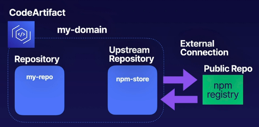

# aws codeartifact intro
An artifact repository that makes it easy for developers to find the software
packages that they need.

Artifact repositories allow a secure area to store, publish, and share software.

This includes open-source and in-house software.

## What is CodeArtifact?
A central repo that can be used by developers to obtain the **correct versions**
of the software packages for their projects.

This integrates with CI/CD system (like CodeBuild).

## What are artifacts?
* Documentation
* Compiled appilcations
* Deployable packages
* Libraries

## Integration with public repositories
* Third-party software - makes 3rd party software available for use (like npm Registry)
* Approved packages - IT leaders can make approved packages available. Often this
means that your engineering team is willing to support it
* Efficient - Developers know where to find approved packages and publish their own,
ensuring consistency across the org

## Integrating with public repositories
* Repository - created within your domain to hold packages
* Upstream repository - an npm store repository could be an example, where it uses
an external connection to pull the package from the public repository and syncs
to the primary repo that devs access

Example architecture for associating repositories to access public code:

