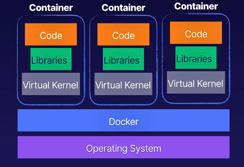

# aws elastic container service intro
Containers are similar to a virtual machine, more like a virtual operating environment.
* Standardized - These are standardized units with everything the software needs to run (libraries,
system tools, code, etc.).
* Microservices - applications are created using independent, stateless components
or microservices running in containers
    * These are typically stateless and can be started/stopped/scaled independently
    * AWS has a whitepaper called "Running Microservices on AWS"
* Docker or windows containers - use Docker for any non-windows loads, Windows containers
for any Windows loads

Container architecture:

## Advantages of containers & microservices architectures
* Highly scalable - if the application becomes over loaded, scale only the services you need to
* Fault tolerant - a single error in 1 of your containers won't bring down the whole app
* Easy to maintain - easier to maintain, update, and change than large mono-apps

## What about ECS?
Container orchestration service that supports Docker and Windows containers.

This is similar to Kubernetes at a high level, but iwth deep integration with AWS
services like IAM, VPC, Route53.

Quickly deploy and scale containerized workloads without having to install, configure,
and manage/scale your own orchestration platform.

* Clusters of Virtual machines - ECS will run your containers on clusters of virtual machines
    * EC2 instances have a lot more control
* Fargate for serverless - use Fargate for serverless containers to not worry about
the underlying EC2 instances

## Elastic Container Registry
* Registry of container images for ECS to connect to and deploy Docker containers

## Services using ECS
* Amazon Sagemaker - quickly deploy and scale ML models for training
* Amazon Lex - build conversational interfaces
* Amazon's own recommendation engine is runnong on ECS

