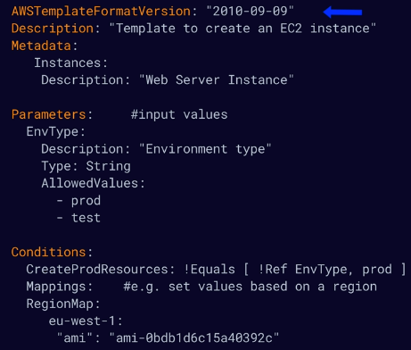
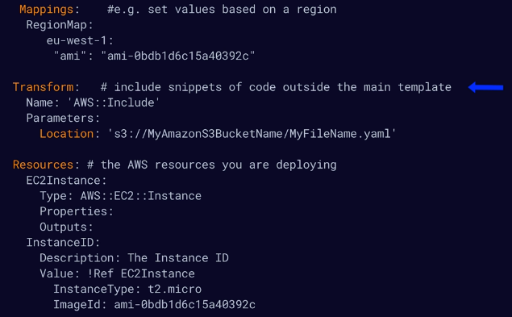

# aws cloudformation intro
Manage, configure, and provision your AWS infrastructure as code.

Resources are defined using a CloudFormation template that is interpreted and creates
appropriate API calls for the resources you've defined.
    * Supports JSON and YAML

## Benefits of IaC/CloudFormation
* Consistent - infrastructure is provisioned consistently with fewer mistakes
* Quick and efficient - less time and effort that configuring things manually
* Version control - you can version control and peer review templates
* Free to use - the tooling is free to use, just pay for provisioned resources
* Manage updates - can be used to manage updates and dependencies
* Rolling back - you can rollb ack to a previous state and delete the entire stack as well

## CloudFormation process
* YAML or JSON template
* S3 - after creating a template you upload it to CloudFormation using S3
* API Calls - CloudFormation reads the template from S3 and executes API calls on your behalf
* CloudFormation Stack - the resulting set of resources from a template

Example CloudFormation template:

CloudFormation has quite a few non-required fields, the only thing that is truly
required are the resource declarations.

**Note:** There are quite a few template snippets that AWS provides for template
examples.

* Resources section is mandatory
* The Transform section is for referencing additional code stored in S3, allowing
for code re-use (like Lambda or template snippets/reusable pieces of CloudFormation code)

## Exam tips
* IaC - allows you to manage, configure, and provision AWS infra as YAML or JSON
* Parameters - input custom values
* Conditions - provision resources based on things like environment
* Resources - section is mandatory and describes resources to create
* Mappings - create custom mappings like using a specific AMI for a given region
* Transform - allows you to reference code or reusable snippets of CloudFormation code
in S3

