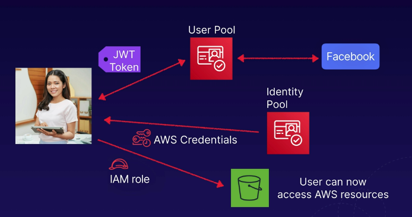

# aws web identity federation
Simplifies authentication and authorization for web applications.

## Features
* User access to AWS resources - Users access AWS resources after successfully
authenticating with a web-based identity provider like Facebook, Amazon, or Google
* Authentication - following a successful authentication, users receive an authentication
code from the web ID provider
* Authorization - users can trade this auth code for temporary AWS security credentials,
authorizing access to AWS resources

## Amazon Cognito
Amazon Cognito is a service that provides web ID federation, including sign-up and sign-in
functionality for your applications and access for guest users.
* This is an **identity broker** managing authentication between your application
and web ID providers, so you don't need to write any additional code
* Supports multiple devices, syncrhonizing user data for multiple devices
* Recommended for mobile - a great use case for any application that has mobile services

### Auth with Amazon Cognito
* Temporary credentials - Cognito brokers between the app and Facebook, Amazon, or Google
to provide temporary credentials
* IAM role - temporary credentials map to an IAM role, allowing access to the required
resources
* Secure and seamless - no need for the application to embed or store AWS credentials locally
on the device. Cognito gives users a seamless experience across all devices

### Cognito user pools and identity pools
* User pools - user directories used to manage sign-up and sign-in functionality
for mobile and web applications
* Sign-in - users can sign-in directly to the User Pool, or using Facebook/Amazon/Google
* Identity pools - enable you to provide temporary access to AWS services like S3 or DynamoDB
    * This is all about guest access, user pools are about account provisioning/login

Example architecture:

## Cognito Push Synchronization
This enables synchronization across different devices.
* Devices - cognito tracks the association between user identity and the various
different devices they sign-in from
* Seamless - Cognito uses push synchronization to push updates and sync user data
across multiple devices
* SNS Silent Notification - SNS notification to all the devices associated with
a given user identity whenever data stored in the cloud changes

## Exam tips
* Web identity federation - allows users to auth with other web identity providers like
Google, Amazon, Facebook by issuing a JWT token for temporary creds
* Best practice for mobile apps is using Amazon Cognito
* Cognito acts as a web identity broker - User sign-up/sign-in, guest credentials, and
multi-device applications
    * User pools - user directories used to manage sign-up/sign-in
    * Identity pools - allows you to provide temporary (guest) access with temp creds
    * Cognito uses push synchronization (silent SNS notifications) to update
    for multiple devices

