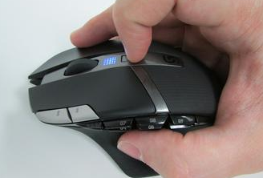

# logitech G602 receiver sensitivity problems
I typically utilize a Logitech G602 for most of my coding and gaming (anything
with quite a few keybinds deserves use from my Razer Naga MMO Gaming mouse).

However, I've recently noticed that the sensitivity settings wouldn't stick when
swapping between the DPI levels. I was getting a consistent blue flashing light
when changing sensitivity, and it would always remain on the most sensitive setting.

After some searching, I determined that the cause was interference from other
peripherals. The strange thing was that the only other item in the general area
was my keyboard wire, roughly 12 inches away.

Sure enough, when I moved the wire away from the mouse by even a few inches it
started to behave normally.

It seems that the receiver is quite sensitive to any interference, it likely deserves
a special place in my setup away from other USB devices to reduce the chances
of future interference.

The mouse in question:

