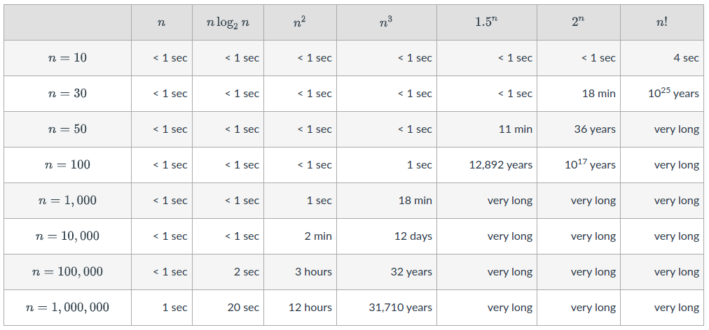

# analysis of algorithms
Analyzing algorithms comes in a set of steps, followed by some mathematical
concepts for presenting pseudocode as mathematical formulas to objectify.

## Pseudocode
An important step of the algorithms discussion is determination of pseudocode
to use as a "middleground" between a higher level programming language
and the Big-O math.

### Example
This is a linear search algorithm written in pseudocode.

Linearly search for an element `k` in an array `A[0...n-1]`

**Note:** Sometimes for assignment `<-` or `:=` is used.

```
LinearSearch(A[0...n-1],k)
    i = 0
    while i < n and A[i] != k
        i = i+1
    if i<n return "Key found"
    else return "Key not found"
```

## Time complexity
Determining the best algorithm for a problem requires determining answers to
the **time complexity** and the **space complexity** of the function.

### Running time
Identifying efficiency (running time) is important. Running time is a parameter of `n`
where `n` is the input size of the algorithm, for BubbleSort `n` is the input array.

The running time is expressed as a function of `T(n)`.

The choice of appropriate **parameters that would impact efficiency** depends on
the function and the problem.

### Order of growth
Writing the function of `T(n)` for run time looks at how many times each algorithm operation
is executed.

```
                                            time to execute           execution
                                            instruction                 count
def PrintHelloNTimes(n):                        t1                        1
    print("Start printing Hello in a Loop")     t2                        1
    for i in range(n):                          t3                      n + 1
        print("Hello")                          t4                        n
    print("End printing Hello")                 t5                        1
```

Time to execute `T(n)` is:
```
T(n) = t1*1 + t2*1 + t3*(n+1) + t4*(n) + t5*1
T(n) = (t3+t4)*n + (t1+t2+t3+t5)
```

This running time is subbed as `T(n) = an+b` where `a` and `b` are constants that depend
on the execution time of each line. where `a = (t3+t4)` and `b = (t1+t2+t3+t5)`.

Since `T(n)` is a form of `an + b` we can say `T(n)` of `PrintHelloNTimes` as a `linear function` of `n`.

Example with `Bubble-sort`:
```
Bubble-sort(a)
 1 for i = a.length() downto 0                ------------------(n+1) * t1
 2     for j = 0 to i-1                       ------------------(n   +   n-1  +  n-2  +.....+1)*t2
 3                if a[j]>a[j+1]              ------------------(n-1  +  n-2  +  n-3  +.....+1)*t3
 4                         swap(a[j],a[j+1]); ------------------at most (n-1  +  n-2   +  n-3  +.....+1)*t4
                 end if
```

**For lines 3 & 4:**
* When i = 0:
    * j = 0 to -1. # j loop will not enter in this case.
* when i =1:
    * j = 0 to 0 # even in this case loop will not be entered.
* when i =2:
    * j = 0 to 1 # loop will be executed for j = 0
* when i = n
    * j = 0 to n-1 # loop will be executed for j=0,1,2,...,n-2

This is known as a **quadratic function** or `n^2`.
When `T(n) = an^2 + bn + c` for simplifying analysis we can consider only the `an^2`,
since the other terms are not as large of an `n`.

`T(n) ~ n^2`

Example growth with the size of the Bubble-sort algorithm:


### Runtimes of different Big-O times
Below is a good table that illustrates the runtimes of different `n` sizes
at different Big-O complexities (ex: `n`, `n^2`)

Example runtime complexity changes at different O's:



This of course is graphable like so:


