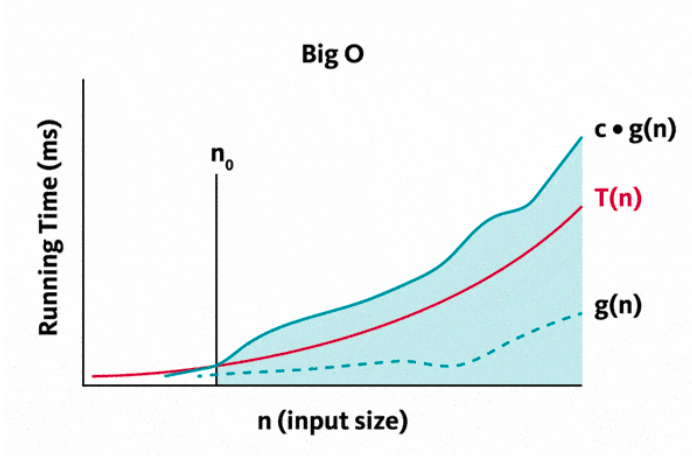

# asymptotic notation of algorithms
Asymptotic is the behavior of a line as itt approaches a curve but never touches it.
In analyzing efficiency we want to know how running time increases as size of input
increases without bound. This uses big-O, omega, and theta.

This is where `T(n)` and `g(n)` can be any nonnegative functions defined as positive integers.
* `T(n)` - running time
* `g(n)` - Some simple function to compare `T(n)` with

## O Notation (Big O)
Informally, `O(g(n))` is a set of all functions with a lower or same order og frowth as `g(n)`
within a constant multiple, as `n` goes to infinity.

We can say `T(n)` is `O(g(n))` if `T(n)` exists in `O(g(n))`

This can be expressed graphically, where `c` is a positive constant

**Formal expression:**
* A function `T(n)` is said to be in `O(g(n))`, denoted by
`T(n) ∈ O(g(n)), if T(n) ≤ c(g(n))` for all `n ≥ n0`, for some positive constant `c`.

## Ω Notation (Omega)
Informally, `Ω(g(n))` is a set of all functions with a higher or same order of
growth as `g(n)` (within a constant multiple, as `n` goes to infinity).
we say a function `T(n) “is Ω(g(n))” if T(n) ∈ Ω(g(n))`.

This can be expressed graphically, where `c` is a positive constant

**Formal expression:**
* A function `T(n)` is said to be in `Ω(g(n))`, denoted by
`T(n) ∈ Ω(g(n)), if T(n) ≥ c(g(n)) for all n ≥ n0` , for some positive constant `c`.

## Θ Notation (Theta)
Informally, `Θ(g(n))` is a set of all functions that have the same order of growth
as `g(n)` ( bounded both above and below by some positive constant multiples of `g(n)`,
as `n` goes to infinity)

We say a function `T(n) “is Θ(g(n))” if T(n) ∈ Θ(g(n))`.

This can be expressed graphically, where `c` is a positive constant

**Formal expression:**
* A function `T(n)` is said to be in `Θ(g(n))`, denoted by `T(n) ∈ Θ(g(n)), if c1 g(n)  ≤  T(n)  ≤  c2 g(n) for all n ≥ n0`,
for some positive constants `c1` and `c2`.

This seems to be a wavier graph that might have tigher bounds (more accurate?).

## Comparing orders of growth
We can use formal definitions of O, omega, and theta but computing the limit
of the ratio of 2 functions is more convenient.

Limits example shown here:

The limit based approach is convenient because it benefits from techniques in calculus.

**Note:**
* `f(n)∈ Θ(g(n))` implies `f(n) = O(g(n))` and `f(n) = Ω(g(n))`  since theta notation
is stronger notation than O- and Ω-notation

## Properties involving asymptotic notations
f(n)
∈
Θ(g(n))
O(g(n))
Ω(g(n))

* Transitivity
    * `f(n) = Θ(g(n))` and `g(n) = Θ(h(n))` imply `f(n) = Θ(h(n))`
    * `f(n) = O(g(n))` and `g(n) = O(h(n))` imply `f(n) = O(h(n))`
    * `f(n) = Ω(g(n))` and `g(n) = Ω(h(n))` imply `f(n) = Ω(h(n))`
* Reflexivity
    * `f(n) = Θ(f(n))`
    * `f(n) = O(f(n))`
    * `f(n) = Ω(f(n))`
* Symmetry
    * `f(n) = Θ(g(n))` if and only if `g(n) = Θ(f(n))`
* Transpose symmetry
    * `f(n) = O(g(n))` if and only if `g(n) = Ω(f(n))`
