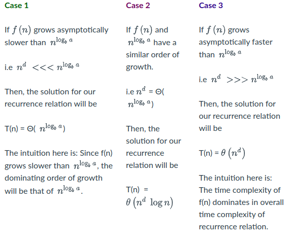
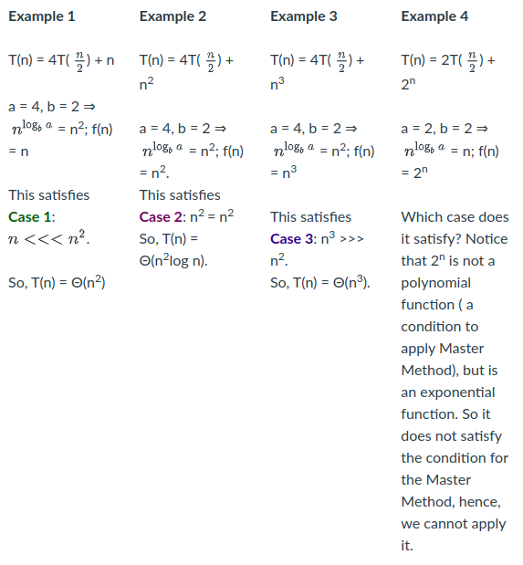

# recursion in algorithms
If you have a problem that can be solved by breaking the problem into smaller problems
then you can use recursion to solve it.

Example:
Factorial of `n` = `n*(n-1) * (n-2) ... 3 * 2 * 1`

```
1 Factorial(n):
2    if n = 0:
3        return 1
4    else:
5        return n * Factorial(n-1)
```


Expressing the Factorial function F in terms of itself can be done:
`F(n) = n* F(n-1)`

The expression of a function in terms of itself is a **recurrence relation**.
    * Requires a base case
    * Requires smaller sub-problems that solve instances of the big problem

## Recurrence relations
To analyze a recursive algorithm, similar to iterative, we need to express it as
an equation to determine the order of growth.

### Terms
* `c` - constant time
* `T(n)` - recursive function execution, subsequent call on `T(n-1)`

### Example
The Factorial recurrence relation can be written as:
`T(n) = c1 or Θ(1)` when n=0 (this represents base case, and c1 is some constant)
`T(n) = T(n-1) + c` when n>0 (this represents recursive case)
`T(n) = T(n-1) + Θ(1)` when n>0 since Θ(1) represents constant time

## Recursion-tree method
When a recursive algorithm makes more than a single call to itself, analysis
can be done by constructing a tree of the recursive calls. It is a visual representation
of recursionw here each node of the tree represents the cost of a recursive sub-problem.
This tree is a recursion tree. Summing the nodes gives the cost of the engire algorithm.

### Example
This is sometimes unreliable, but accurate time complexity can be found by using
the substitution method.

```
        c1                for n=1 (when start = end)

T(n)

        2T(n/2) + cn      for n>1
```

#### Level 0
Making 2 recursive calls in the same execution.
```
Level 0     T(n)            cn
                          /    \
Level 1              T(n/2)     T(n/2)
```

#### Level 1
We can find the expansion of `T(n/2)` it can be writtn as `2T(n/4) + c(n/2)`
```
Level 1      T(n/2)          cn/2
                           /      \
Level 2               T(n/4)      T(n/4)
```

#### Level 2
We can find the expansion of `T(n/4)` it can be writtn as:
```
Level 2      T(n/2)          cn/4
                           /      \
Level 3               T(n/8)      T(n/8)
```

## The master method
Master metod enables solving for recurrence relation of the form `T(n) = aT(n/b) + f(n)`.
Where `a >= 1, b > 1, and f(n) > 0`.

### Example
```
T(n) = T(n/2) + c; here a = 1, b =2 and f(n) = c

T(n) = 3T(n/2)+ cn; here a = 3, b = 2 and f(n) = cn
```

In this method, `n^logb a` and `f(n)` values are compared. When comparing two
functions there are three cases `n^logb a` grows asymptotically at a faster rate
than `f(n)`, or `n^logb a` grows at a slower rate than `f(n)`, or both have same order
of growth.

For simplicity consider `f(n)∈ Θ(n^d)` so that we can easily compare `n^d` and `n^logb a`.

This screenshot showcases the different growth type comparisons:



Looking at the cases we can make examples:



### Limitations of master method
Recurrence relation satisfies a few conditions before applying the master method.
This brings these limitations:
* Recurrence must satisfy `a >= 1, b > 1, f(n)` is a positive function
* Master method cannot be applied if `f(n)` is not a polynomial function
* Master method cannot be applied if `a` or `b` cannot be expressed as a constant

#### Special case
`f(n) ∈ Θ(n^(logb a) * log^k(n))` for some `k >= 0` then `T(n) = Θ(n^(logb a) * log^(k+1)(n))`
