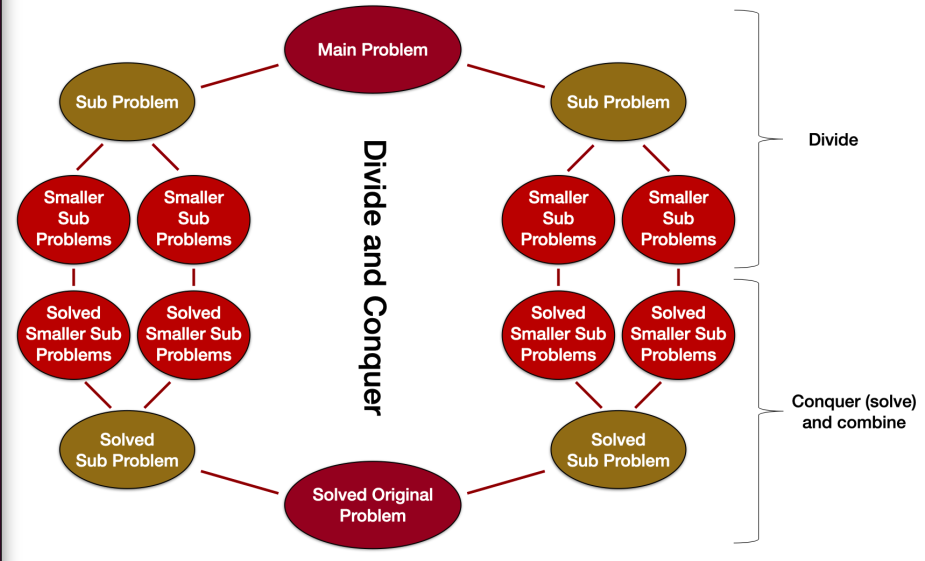
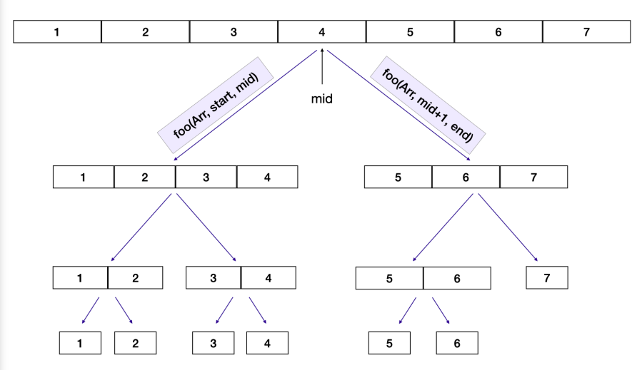

# divide and conquer in algorithms
Divides the problem into smaller subproblems and then conquer (or solve) the subproblems
first, then combine the results to get the solution to the problem.

There are 3 steps:
* Divide - In the first step we break the problem into smaller subproblems
* Conquer - This step involves solving the subproblems
* Combine - In the last step, we combine the sollutions of the subproblems
to get the solution for the larger problem

Example diagram of the divide and conquer technique in action:



## Example array splitting
This function splits an array into individual indices until you're out of splits.

```
foo(arr, start, end):
    if(start < end):
        middle = (start + end) // 2
        foo(arr, start, middle)
        foo(arr, middle + 1, end)
```

Array splitting (does not create new objects, splits existing):



Once we have the smallest size of the problem we perform the solution, double each item:

```
foo(arr, start, end):
    if(start < end):
        ...
    else:
        arr[start] = 2 * arr[start]
```
