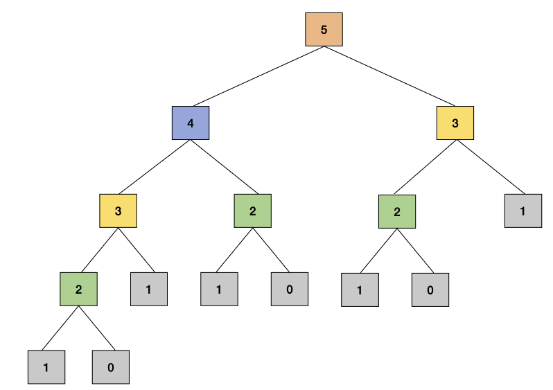

# dynamic programming approaches
When working with algorithms we will sometimes see that we can store values rather
than recalculating, so that we don't have to solve for them past the first time.

Dynamic programming helps to reduce the number of recalculations in this fibonacci sequence.

## Example Fibonnaci sequence
When n=0 or n=1, F(n) will return 1; and for other values of n the function F(n)
will return F(n-1) + F(n-2).

Here F(n) represents our function itself unlike T(n) in recurrence relation
in the previous exploration, where T(n) represents the time taken to solve
problem of size n.

### Algorithm

```
Fib(n):
    if n = 0:
        return 1

    else if n = 1:
        return 1

    else:
        return Fib(n-1) + Fib(n-2)
```

### Call tree
This is a recursive call tree for `n = 5` showcasing we have calculated the same
result several times.



### Speed and subproblems
We're repeating our work for the same subproblem, when we ask if we can
speed this up we clearly can.

To avoid redoing the work of overlapping subproblems by storing the result after
solving, we'll be able to run faster.

## Two approaches to Dynamic Programming
This is a powerful algorithm design technique that can be used to solve
problems that have strictly overlapping subproblems. There are two approaches
that can be used:
* Top-down
* Bottom-up

### Top-down approach
In this example the new variable `FibMemo` is a dictionary (key-value) that
is used to look up the stored results of the subproblems we've seen.

This is also "seeded" with base case values.

If this is run for `n = 2` we would get `FibMemo = {0:1, 1:1, 2:2,}`.

```python
FibMemo = {
    0: 1,
    1: 1,
}


def Fib_top_down(n):

    if n in FibMemo:
        return FibMemo[n]

    FibMemo[n] = Fib_top_down(n-1) + Fib_top_down(n-2)

    return FibMemo[n]


print(Fib_top_down(5))
```

#### Time complexity
For every `k`, that belongs to `[1, n]` we calculate `Fib_top_down(k)` once.

```
T(n) = T(n-1) + theta(1)
```

This yields a complexity of `Theta(n)`

##### Secondary time complexity analysis
If we spend time to calculate only non-memoized values of `n, n-1, ..., 1`. Memoiozed calls
are a constant time `Theta(1)` since we only have to look up the value in the structure.

```
Time Complexity = number of Subproblems * time/subproblem
                = n * theta(1)      [constant time, independent of "n"]
                ∈ Theta(n)
```

#### Slight tweak - no global scope
By passing reference to each subproblem we can avoid global scope.

```
def fib_top_down2(n, fibmemo=None):
    if fibmemo is None:
        fibmemo = {0:1, 1:1}
    if n not in fibmemo:
        fibmemo[n] = fib_top_down2(n-1, fibmemo) + fib_top_down2(n-2, fibmemo)

    return fibmemo[n]
```

### Bottom-up approach
We solve smaller sub-problems first then combine the results until we solve the bigger
problem.

This approach is also called 'tabulation' as we are constructing the table of
results of all sub-problems until we reach the value of `n` for our problem.

For this we'll start with `n=0, 1` then find `n=2, 3` up to `n`

```python
def fib_bottom_up(n):
    fib_table = [0]*(n+1)

    fib_table[0] = 1
    fib_table[1] = 1

    for i in range(2,n+1):
        fib_table[i] = fib_table[i-1] + fib_table[i-2]

    return fib_table[n]
```

#### Time complexity analysis
We're executing a for loop for range `n`, this will be `Theta(n)`

### Comparing top-down and bottom-up approaches
* Top-down -
    * Start with the **bigger problem** and go down to the base case
    * We store the solution of the subproblems in extra memory space to avoid recomputing
    solutions
    * This is implemented typically with recursion
* Bottom-up -
    * We start with the **base case** and solve bigger problems as we progress to
    the actual problem (`n`)
    * This is typically an iterative approach that builds up the solution
    of the sub-problems and stores the solution in extra memory space
