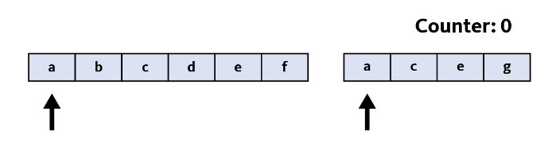
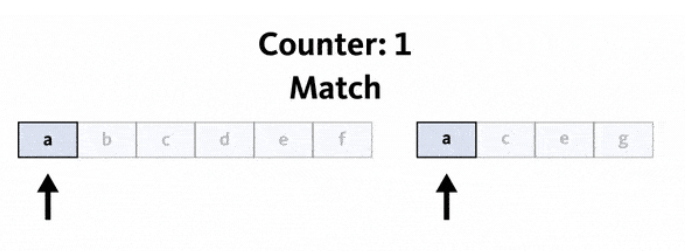
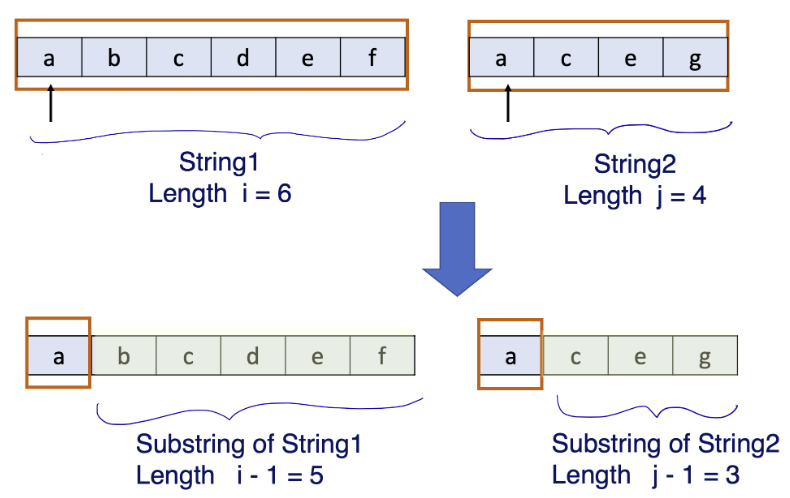
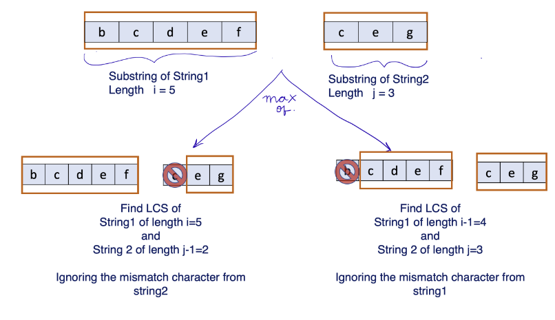

# when to use dynamic programming and the steps to do it
This explanation will use the longest common subsequence problem as an example.

The idea is that we'll identify where to use the dynamic programming approaches
in programming and the steps to succeed.

## Where to use dynamic programming
For a problem to be solvable using dynamic programming it needs 2 characteristics:
* Overlapping subproblems - This is to avoid re-computation of the same sub-problem.
    * Ex: Fibonacci number problems would require recomputing many overlapping
    subproblems to arrive at our answer
* Optimal structure - This is the optimum "solution" or the final result of the
problem that can be formed from an optimal solution of the sub-problems.
    * This is a bad definition, effectively we want to find the min/max
    value and the optimal solution to 1 case, then searching for patterns
    to determine things like:
        * Can we get the base case well defined?
        * Is the problem capable of being decomposed further?
        * Can I store some of these calculations and pass a reference to it?
            * Should I use a substructure like a map?

## Steps to approach dynamic programming
1. Identify the parameters that impact the problem
1. Identify the subproblem
1. Define the recursive formula including the base case
1. Implement a naive recursive solution (This is optional, though it will help you get a good understanding of dynamic programming)
1. Turn the recursive formulation into dynamic programming algorithm
    1. Optimize the recursive solution to use cache (memoization)
    1. Implement using the top-down or bottom-up approach

## Example - longest common subsequence
Given two strings return the length of their longest common subsequence of characters.

### Example invocation
* input - `str = "abcdef", str="apceg"`
* output - `3`
* explanation - The longest subsequence is `"ace"` and its length is `3`

### Recursive solution
When given two strings our minds look at it and directly see the answer.
The harder part is recursively arriving at it via the code.

**Defining the algorithm:**
`LCS[i,j]: Longest common subsequence of strings of lengths i and j.`

#### Steps (rough outline)
1. Start a counter at `0`
    
1. Looking at the first character of string 1, `str1`, being `"a"` and the value
of string 2, `str2`, being `"a"`. Iterate the counter.
    
1. Moving to the 2nd character, `"b"` and `"c"` don't match. Iterate the counter.
1. Next character is `"e"` which also does not match. Iterate the counter.
1. Continue this until we find a match or reach the end of the 2nd string.

#### Steps (detailed)
1. Identify the parameters that impact the problem: Length of `str1` and `str2` impact our problem.
1. Identify the subproblem: In our solution analysis, observe that after we have
compared the first characters of the strings, the remaining subproblem is again
a longest common subsequence problem, on two shorter strings.  The below figure
explains this. First, we look at the problem for strings of lengths
`i, j (i=length of string1, j=length of string2)`. Since it matched, we are looking
for a solution to the problem of size `i-1` and `j-1`.
    1. We can define the subproblem as: `LCS[i,j]: Longest common subsequence of strings of lengths i and j.`
    
1. Define the recursive formula: Based on the understanding from step 1 and step 2,
we can see that when we are matching the first characters of two strings, they
would either match or not match, which gives us two cases.
    1. As in the above figure when we are solving for `LCS[i,j]` when the first
    characters match we will count it as one match and add 1 to the result of
    substrings of lengths `i-1` and `j-1`. This can be written mathematically as:
        1. We can define the subproblem as: `LCS[i,j] = 1 + LCS[i-1, j-1]   When the first characters of str1 of length i and str2 of length j match.`
    1. When they don't match, we have two options. The first option is to find
    the LCS of `str1` of length `i` and `str2` of length `j-1` (here we are excluding
    the mismatching character from string2). The second option would be to find
    the LCS of `str1` of length `i-1` and `str2` of length `j` (excluding the mismatching
    character from `str1`). Then, take the maximum of the two. The below figure
    demonstrates this.
        
        1. We can define the subproblem as: `LCS[i,j]= max{ LCS[i, j-1] , LCS[i-1 , j] } when the first characters of str1 of length i and str2 of length j do not match.`
1. Finally, the base case, when the length of `str1` or `str2` is `0` then the LCS value will be `0`.
    1. We can define the subproblem as: `LCS[i,j] = 0 when i = 0 or j = 0`
    ```
                0                               if i=0 or j=0
    LCS[i,j] =  1 + LCS[i-1,j-1]                if the first characters of str1 (length i) and str2 (length j) match
                max{ LCS[i,j-1], LCS[i-1,j] }   if the first characters of str1 (length i) and str2 (length j) DO NOT match
    ```
1. Impelement a naive recursive solution

#### Time complexity
This is an exponential problem. For every character we have two possible choices,
it can either be in the subsequence or it cannot. So worst-case time complexity
will be `O(2^n)`, where n is the length of the longer string.

## Bottom-up approach

This table is a two dimensional array to store results, we need extra space to store
results of the base case `LCS[0,1], LCS[1,0], etc.`.

If our strings are of lengths `m, n` we need a 2-D array of size `[m+1]*[n+1]`

### Example table

```
       " "	B       A       C
        0	1	2	3
"" 0    0       0       0       0
A  1	0
B  2	0
C  3	0
D  4	0
T  5	0
```

### Algorithm
```python
cache = [[0 for x in range(n+1)] for x in range(m+1)]

for i in range(m+1):
    for j in range(n+1):
        if i==0 or j==0:
            cache[i][j] = 0
        elif str1[i-1] == str2[j-1]:
            cache[i][j] = cache[i-1][j-1] + 1
        else:
            cache[i][j]= max(cache[i-1][j] , cache[i][j-1])
```
